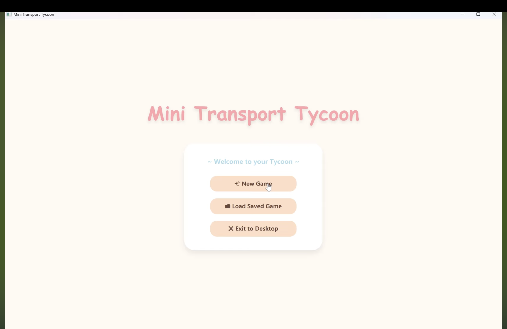
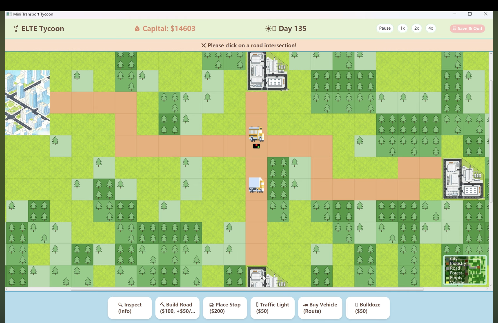
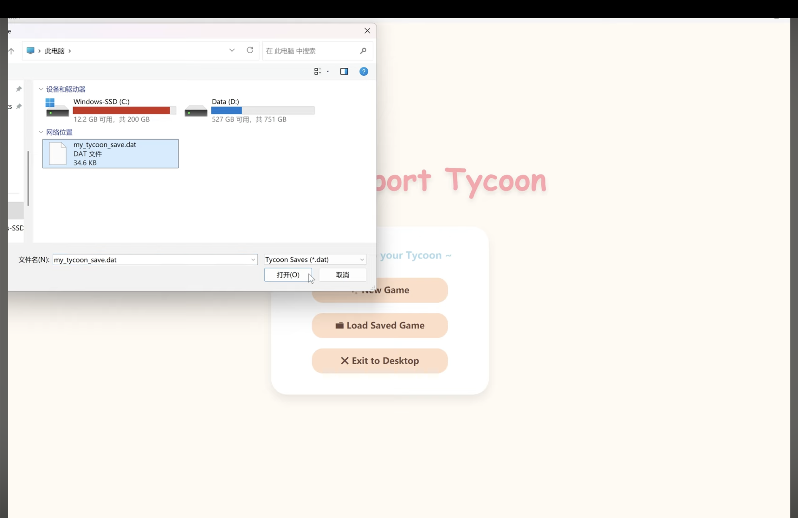

# Mini Transport Tycoon

A desktop transportation and economy simulation built as a three-person team project for the **Software Technology Practice** course (2025/2026 Spring) at **ELTE Faculty of Informatics**.

Players build road networks, create passenger and cargo routes, manage vehicles, and keep the transport company financially sustainable.

[Watch the demo video](https://youtu.be/NTQCkYRhuA4)

## Highlights

- Grid-based world with cities, industries, forests, roads, and stops
- Passenger and cargo transportation with configurable circular routes
- Vehicle movement, routing, queues, and collision handling
- Adjustable simulation speeds
- Save and load support
- Navigable minimap
- Installable traffic lights with configurable north-south and east-west phases
- Automated tests with JaCoCo coverage reporting

## Screenshots

### Game overview



### Minimap navigation



### Forest tiles



## My Contribution — Erfan Alizadeh

I was responsible for the **traffic-light feature** and its integration into the simulation.

My work included:

- Modeling traffic-light phases for north-south and east-west movement
- Implementing automatic phase switching with configurable green-light durations
- Controlling whether vehicles can pass based on their direction
- Connecting traffic lights to road junctions
- Supporting installation and visualization through the game interface
- Contributing fixes for junction behavior and UI layout

Relevant code:

- [TrafficLight.java](src/main/java/tycoon/model/TrafficLight.java)
- [SignalPhase.java](src/main/java/tycoon/model/SignalPhase.java)
- [Junction.java](src/main/java/tycoon/model/Junction.java)

## Technology

- Java 17
- JavaFX 17
- Maven
- JUnit 5
- JaCoCo
- Git
- MVC-oriented architecture

## Getting Started

### Prerequisites

Install:

- JDK 17 or newer
- Apache Maven 3.8 or newer

Confirm the installation:

```bash
java -version
mvn -version
```

### Clone and run

```bash
git clone https://github.com/erfanalizadeh8063-bit/mini-transport-tycoon.git
cd mini-transport-tycoon
mvn javafx:run
```

### Run the tests

```bash
mvn clean test
```

The current test suite contains **46 passing tests** with no failures or errors.

A JaCoCo coverage report is generated at:

```text
target/site/jacoco/index.html
```

## Main Features

- **Map system:** A two-dimensional tile grid containing cities and industrial facilities
- **Infrastructure:** Roads, stops, junctions, forests, and traffic lights
- **Economy:** Construction costs, vehicle purchases, transport income, and bankruptcy conditions
- **Logistics:** Passenger transport and multiple industrial cargo types
- **Routes:** Configurable circular routes with automated vehicle movement
- **Time control:** Pause, normal, fast, and very-fast simulation modes
- **Persistence:** Multiple save files and restoration of active journeys
- **Traffic control:** Timed signals with separate directional phases

## Team

| Member | Main responsibility |
| --- | --- |
| Erfan Alizadeh | Traffic lights and related junction/UI integration |
| Srinivas James Madoc | Forests and minimap |
| Jiayu Kang | Persistence and continuous vehicle movement |
| All team members | Base game, integration, testing, and documentation |

## Academic Context

This repository preserves the original team commit history and credits each contributor. It was developed as coursework at ELTE Faculty of Informatics and is presented here as part of my software-development portfolio.
